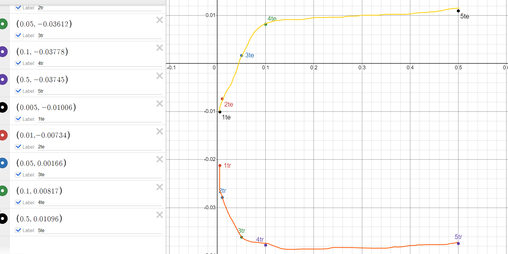

# Constants
data_number = 400
dropout = true
rand = 0
act = sigmoid

9326 -> 933 -> 9 -> 1

# Variables
Alpha

# Observations
### Training Error
For the first 5 epochs of the leanring algorithim:
- The average training error (tr) decreased exponentially with increases in alpha.
- The average testing error (te) increaed logarithmically with increases in alpha.

This would suggest that as alpha increases, the nn tends to overfit the data 