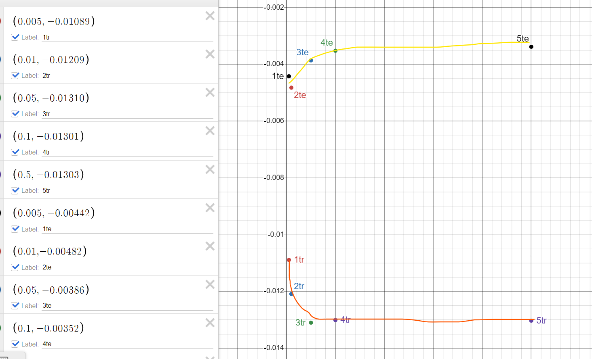

# Constants
data_number = 400
dropout = true
rand = 0
act = sigmoid

9326 -> 933 -> 9 -> 1

# Variables
Alpha

# Observations
### Training Error
**For the first 5 epochs of the leanring algorithim, with increases in alpha:**
- The average change in training error (tr) increased logarithmically in the negative direction.
- The average change in testing error (te) increaed logarithmically with increases in alpha.

**For the first 15 epochs of the leanring algorithim, with increases in alpha:**
- The average change in training error (tr) increased logarithmically in the negative direction.
- The average change in testing error (te) increaed logarithmically in the positive direction .

**Comparing both graphs:**
- The average change in training and testing error are much smaller as the number of epochs being considered increases.

### Inferences
- As alpha increases, the nn tends to overfit the training data, and thus performs worse on testing data. 
- Average change in training and testing error decreases with epochs likely because as we approach the local maxima (best possible weights) the training and testing error decreases more slowly.
- This is shown as according to the graphs we can predict that as alpha increases, we approach a maximum average decrease in training error with each epoch, however, we also approach a maximum average increase in training error (for 5 epochs, this value is greater than zero, but for 15 epochs, it seems to approach zero). 

### Conclusion
- Alphas around the range of 0.005 - 0.01 are ideal for this system.
- Depending on alpha