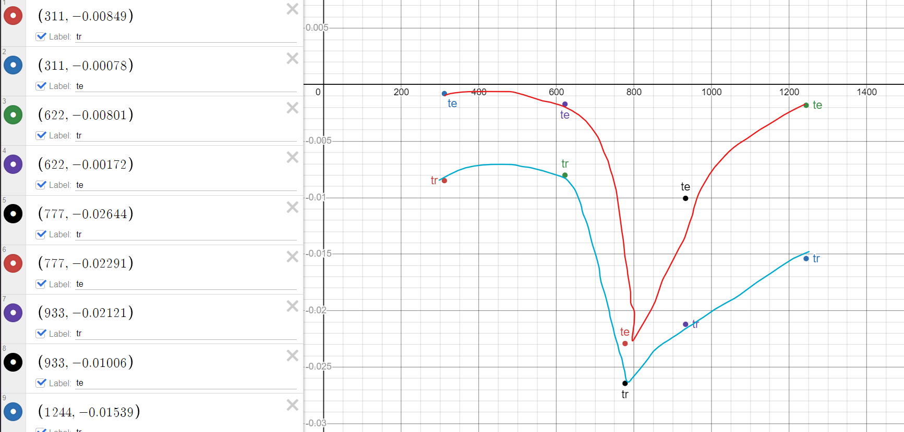
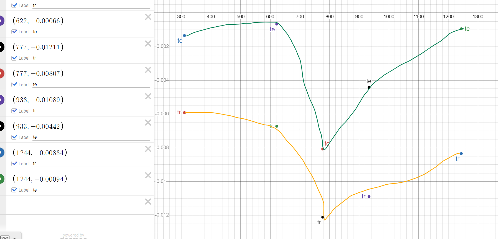

# Constants
data_number = 400
dropout = true
alpha = 0.05
rand = 0
act = sigmoid

9326 -> _ -> 9 -> 1

# Variables
Node in hidden layer 1, h1

# Observations
### Training Error
**For the first 5 epochs of the leanring algorithim, with increases in alpha:**
- The average change in training error (tr) and testing error (te) increased exponentially in the negative direction to a maximum and then decreases.

### Testing Error
**For the first 5 epochs of the leanring algorithim, with increases in alpha:**
- The average change in training error (tr) and testing error (te) increased exponentially in the negative direction to a maximum and then decreases.
15 epochs

### Inferences
- For this system there is a "sweet" spot of 1st layer hidden nodes.
- Varying h1 doesn't cause the network to overfit as te and tr both change proportionally.

### Conclusion
- There is a value of h1 that results in the max tr and te for a certin system. It is uncertain however, how to find the correct h1 for a given system besides trial and error.